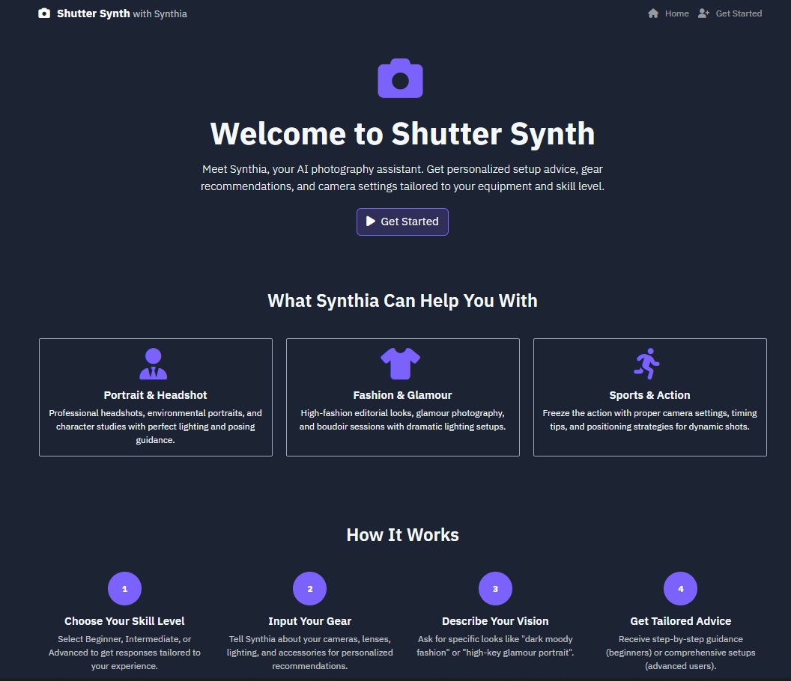
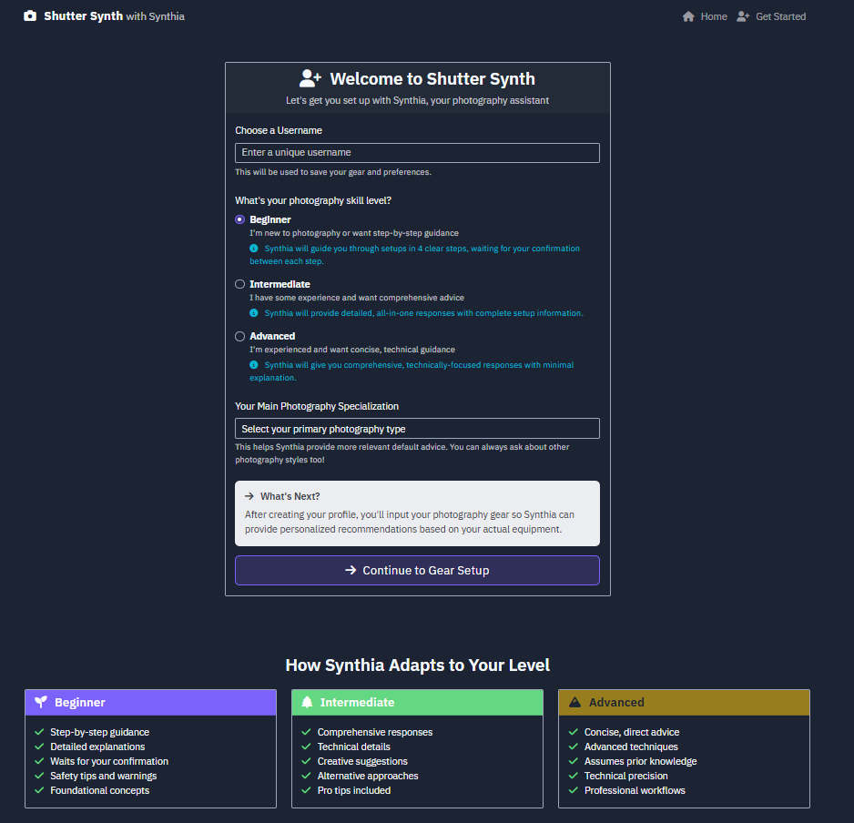
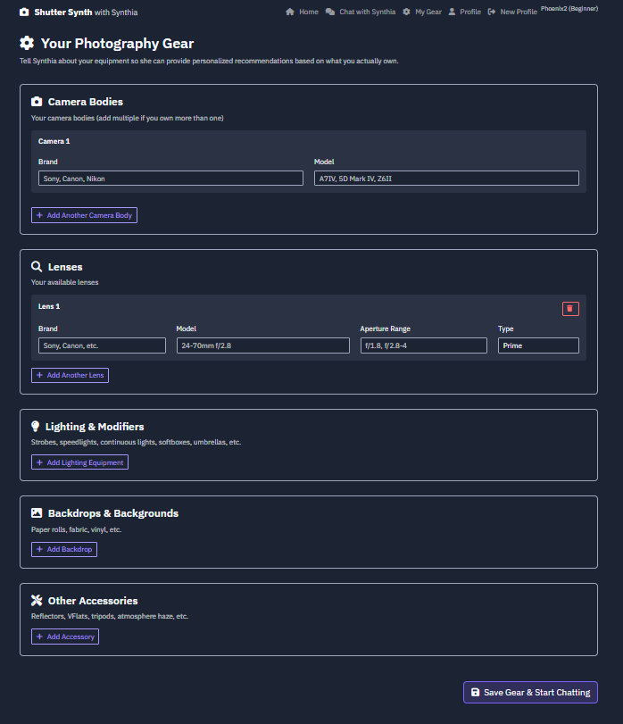
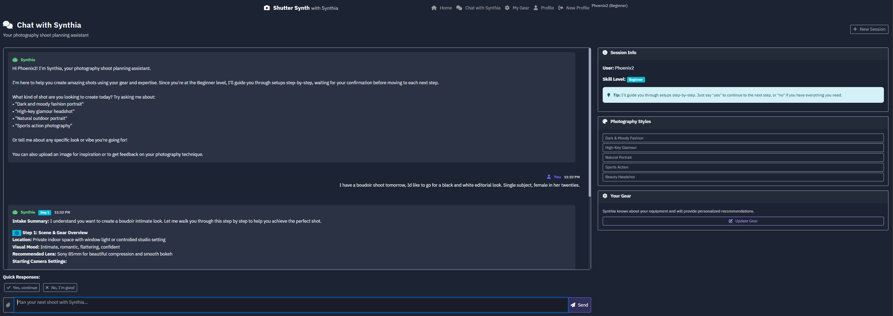

# Shutter Synth

## Your AI Photography Planning Assistant

Shutter Synth is an intelligent assistant designed to help photographers plan their shoots with personalized advice on setups, gear, camera settings, and techniques. Whether you're a beginner looking for step-by-step guidance or an advanced user seeking concise technical details, Synthia adapts to your skill level and helps you achieve your creative vision.

---

## Key Features:

* **Personalized Advice:** Get tailored recommendations based on your photography skill level (Beginner, Intermediate, Advanced).
* **Intelligent Gear Recommendations:** Input your camera bodies, lenses, lighting, and accessories, and Synthia will suggest the best equipment from *your collection* for any given shoot scenario.
* **Context-Aware Conversations:** Synthia understands follow-up questions and maintains context to provide continuous, relevant guidance throughout your planning session.
* **Genre-Specific Planning:** Get detailed advice for various photography styles, including Fashion, Portrait, Sports, Glamour, Boudoir, and Headshot.
* **Interactive Chat Interface:** A user-friendly chat experience for seamless interaction.
* **Secure & Robust:** Recently updated with critical security fixes, enhanced input validation, and improved error handling for a robust experience.

---

## How It Works:

1.  **Choose Your Skill Level:** Select your expertise (Beginner, Intermediate, or Advanced) during onboarding.
2.  **Input Your Gear:** Tell Synthia about your camera bodies, lenses, and other equipment.
3.  **Describe Your Vision:** Start a chat with Synthia, describing the look or type of shoot you're planning.
4.  **Get Tailored Advice:** Synthia provides immediate, actionable advice and continues to guide you through follow-up questions.

---

## Screenshots:

* **Welcome Page:**
    

* **Skill Level Selection:**
    

* **Gear Input:**
    

* **Chat Interface:**
    

---

## Getting Started:

To run Shutter Synth locally, clone this repository and follow the setup instructions in the `app.py` or relevant documentation.

```bash
# Example (replace with actual clone command if this is a private repo)
git clone [https://github.com/YOUR_GITHUB_USERNAME/Shutter-Synth.git](https://github.com/YOUR_GITHUB_USERNAME/Shutter-Synth.git)
cd Shutter-Synth
pip install -r requirements.txt
python app.py

Technologies Used:
Python

Flask (Web Framework)

Jinja2 (Templating Engine)

HTML, CSS, JavaScript

SQLite (Database)

Future Enhancements:
Integration with external APIs for weather, location data.

Advanced image analysis for inspiration feedback.

Expanded knowledge base for more niche photography genres.

Contributing:
Contributions are welcome! Please feel free to open issues or submit pull requests.